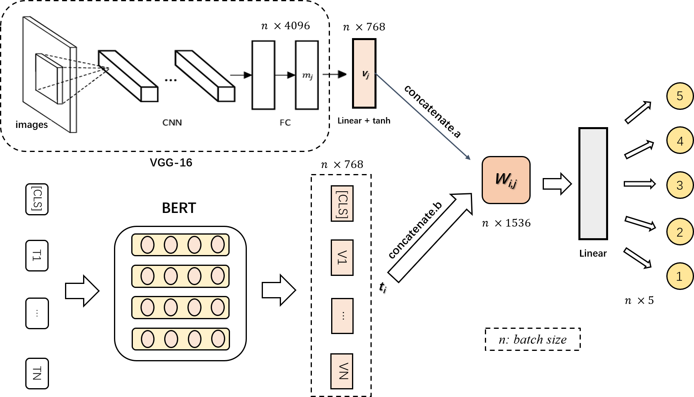
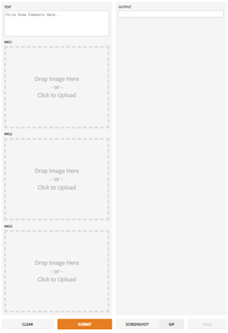

# Multimodal-Sentiment-Analysis

## Introduction

In this project, a multi-modal neural network based on feature extraction is built to realize the overall sentiment analysis of graphic and text data.
- First of all, in view of the alignment problem of multimodal information, this project introduces a multi-modal sentiment analysis model based on visual aspect attention network, and utilizes the **attention mechanism** to achieve a classification accuracy of **61.92%** on the Yelp data set of user reviews. 
- On this basis, *VGG-16* neural network and *BERT* pre-trained model were added to extract the features of images and texts respectively. In addition, crossmodal feature alignment and fusion were achieved through vector concatenation. 
- In the end, the fusion vector was passed to the classification layer as input to achieve the structural 
improvement of the overall model.

The classification accuracy of the improved multi-modal sentiment analysis model based on graphic and text feature extraction on the same data set reached **64.70%**, which achieved a **2.78%** performance improvement over the basic introduced model.

## Data

The raw data contains both image and text files which are stored in *'.jpg'* format and *'.json'* format, they do not exist in this Github repository due to upload specifications on file size limitation.

## Model

The overall model structure is depicted as following:

## Deployment
The improved model is compressed and deployed on the web mobile terminal, and a friendly human-computer interaction function is realized by using the visual interface.

